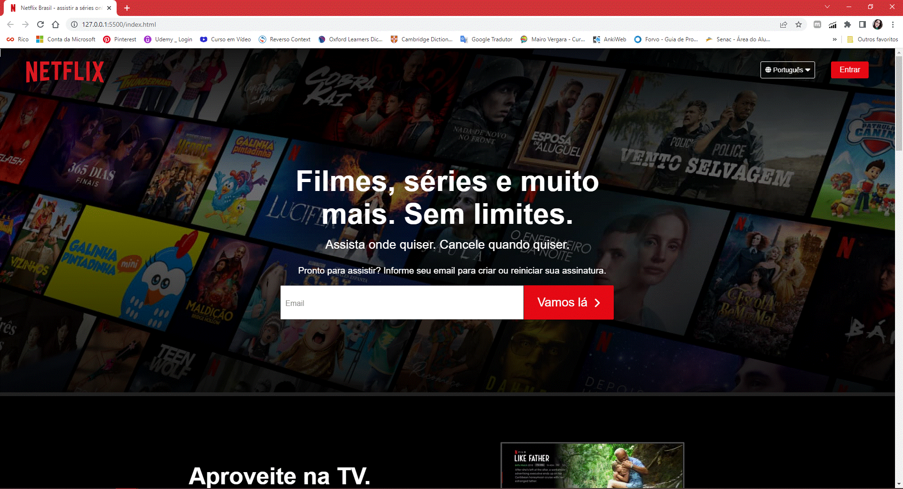

#  Clone Netflix
Recriando Página Inicial do Netflix
 
 

## Objetivo
O objetivo é recriar a interface da página inicial do Netflix, um dos principais sites de streaming do mundo, com tecnologias como HTML5, CSS3 e JavaScript.
 

Neste projeto foi necessário utilizar uma fonte diferente da utilizada pela Netflix (fonte Netflix sans que é privada).
 
 

## Tecnologias
 - HTML5
 - CSS3
 - JavaScript
 
 

## Detalhes

:iphone:

  
  
  

 
 

:tablet:

  
  

 
 

:computer:

  
   
  

 
 

:tv:

  

 
 

## Autoria
### Autora
Ioly M. M. Oliveira
